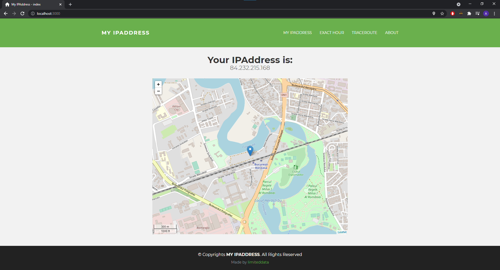
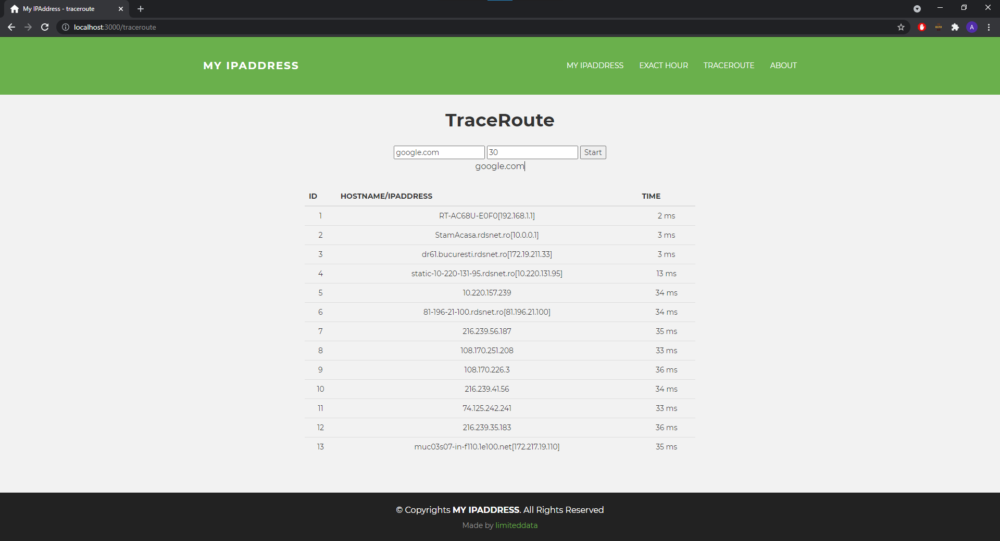

This is a quick app i've made using Express.js.

Once started it can show your external ipaddress aswell with a aproximate location using either your browser geolocation and if not available it will only use your ipaddress to aproximate it.

Just use 'npm start' and you are good to go.

It can also show you the current hour in most time zone.

And it can TraceRoute using windows tracert command.

